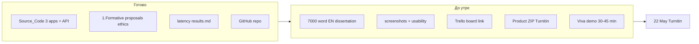

# План за CMP600 подаване (22 May 2026)

## Отговор на въпроса: можем ли да се справим?

**Да — с интензивна работа до утре**, без допълнителен софтуерен развой. Имате повече от достатъчно **технически артефакт** и **формативна основа**; липсва главно **писане + опаковане за Turnitin**.

| Компонент (40% + 40% + 20%) | Статус | Коментар |
|-----------------------------|--------|----------|
| **Project Product** | ~90% готов | 3 React apps + FastAPI, GitHub: [PierMobayed/CMP600_Dissertation_Project](https://github.com/PierMobayed/CMP600_Dissertation_Project.git) |
| **Formative подготовка** | Готова | Proposal (Task 2), презентация + видео (Task 1), Ethics HE35, Finalised Formative |
| **Project Documentation** | ~10% готов | [`Dissertation_Main_Document.docx`](c:\Users\PierM\OneDrive - Planet Education Networks\Study\year3\(NCG Comp 1.5) Dissertation\Assessment\CMP600_Dissertation_Project\Documentation\Dissertation_Main_Document.docx) съдържа ~706 думи **български outline**, не финален английски текст |
| **Evaluation evidence** | Частично | Latency ✅ ([`Tests/performance/results.md`](c:\Users\PierM\OneDrive - Planet Education Networks\Study\year3\(NCG Comp 1.5) Dissertation\Assessment\CMP600_Dissertation_Project\Tests\performance\results.md)); usability ❌ (шаблон празен) |
| **Viva** | ~30% | [`Viva/demo_video_script.md`](c:\Users\PierM\OneDrive - Planet Education Networks\Study\year3\(NCG Comp 1.5) Dissertation\Assessment\CMP600_Dissertation_Project\Viva\demo_video_script.md) — няма screenshots/video |
| **Agile (Trello/Jira)** | Липсва | Задължително в [Assessment Brief](c:\Users\PierM\OneDrive - Planet Education Networks\Study\year3\(NCG Comp 1.5) Dissertation\Assessment\2.Assessment Brief\Assessment Brief .docx) — трябва ретро-дъска + линк в гл. 3 |
| **Log Book** | Шаблон попълнен | [`Dissertation Log Book 1.docx`](c:\Users\PierM\OneDrive - Planet Education Networks\Study\year3\(NCG Comp 1.5) Dissertation\Assessment\2.Assessment Brief\Dissertation Log Book 1.docx) — deadline 22 May; допълнете tutorial бележки ако липсват |

**Нужна ли е „друга помощ“?**
- **Не** за нов код или архитектура.
- **Да** за: (1) масово писане на глави на английски, (2) 2–3 часа ръчна работа (screenshots + heuristic review + Viva репетиция), (3) по желание Cursor/AI чернови по [`WRITER_BOT_Dissertation_Instructions.md`](c:\Users\PierM\OneDrive - Planet Education Networks\Study\year3\(NCG Comp 1.5) Dissertation\Assessment\CMP600_Dissertation_Project\Documentation\WRITER_BOT_Dissertation_Instructions.md) с ваша редакция.
- **Supervisor draft review** вече не е възможен (правило: без feedback в последните 4 седмици преди deadline).



---

## Какво изисква Assessment Brief (3 елемента)

Източник: [`2.Assessment Brief/Assessment Brief .docx`](c:\Users\PierM\OneDrive - Planet Education Networks\Study\year3\(NCG Comp 1.5) Dissertation\Assessment\2.Assessment Brief\Assessment Brief .docx)

1. **Project Documentation (40%)** — един Word/PDF ~7000 думи, Harvard, Arial 12, 1.5 spacing, cover page, research + planning + design + evaluation + PM (Trello) + references.
2. **Project Product (40%)** — работещ прототип + **ZIP** към Turnitin; GitHub като доказателство.
3. **Viva Voce (20%)** — 30–45 мин live demo + въпроси (без бележки при защита).

Форматиране и структура: копирайте от [`Assessment Brief-templete.docx`](c:\Users\PierM\OneDrive - Planet Education Networks\Study\year3\(NCG Comp 1.5) Dissertation\Assessment\2.Assessment Brief\Assessment Brief-templete.docx) + [`Dissertation Cover Page.docx`](c:\Users\PierM\OneDrive - Planet Education Networks\Study\year3\(NCG Comp 1.5) Dissertation\Assessment\2.Assessment Brief\Dissertation Cover Page.docx).

**Целеви word budget** (от template):

| Глава | Думи (ориентир) |
|-------|-----------------|
| Ch1 Introduction | ~1400 |
| Ch2 Literature Review | ~1800 |
| Ch3 Methodology | ~2000 |
| Ch4 System Design & Implementation | (в template — без отделен cap; ~1500–1800 общо с имплементация) |
| Ch5 Evaluation & results | ~900 |
| Ch6 Discussion | ~1000 |
| Ch7 Conclusion | ~1000 |
| Abstract | ≤1 A4 |

Заглавие (от Log Book / proposal): *Design and Evaluation of an Interactive Dashboard for Visualising Big Data in Logistics Operations* — може леко да се уточни към „integrated multi-application door-to-door prototype“, но **не сменяйте темата** в последния момент без причина.

---

## Карта: формативни файлове → финални глави

| Източник в [`1.Formative`](c:\Users\PierM\OneDrive - Planet Education Networks\Study\year3\(NCG Comp 1.5) Dissertation\Assessment\1.Formative) | Къде в дисертацията |
|--------------------------------------------------------------------------------|---------------------|
| `Task 2/3.Expanded_Dissertation_Proposal_...docx` | Ch1 aim, objectives, questions, scope |
| `Research Ethics Approval Form HE35` | Ch3 ethics + Appendix |
| `Task 1` presentation + `Narration Script.docx` | Ch1 significance; Viva narrative |
| `Documentation/Requirements Document.docx` | Ch3–4 FR/NFR таблица |
| `Documentation/Architecture Document.docx` | Ch4 diagrams |
| `Documentation/API_Contract_v1.docx` | Ch4–5 + Appendix |
| `Documentation/Evaluation_Plan_v1.docx` | Ch5 methodology |
| `Documentation/Implementation_Notes_DEV.md` | Ch4–5 backend/apps (преразкажете, не копирайте README) |
| `Documentation/Door_to_Door_Routing_Strategy.md` §8 | Ch4–5 driver routing |
| `Tests/performance/results.md` | Ch5 numbers (p50/p95) |
| `Tests/usability/heuristic_review.md` | Ch5 след 1 преглед |
| `GAP_Checklist_Tracking.md` | Не твърдете неща маркирани ❌ |

Наръчник за попълване: [`Dissertation_Population_Guide.md`](c:\Users\PierM\OneDrive - Planet Education Networks\Study\year3\(NCG Comp 1.5) Dissertation\Assessment\CMP600_Dissertation_Project\Documentation\Dissertation_Population_Guide.md).

---

## 24-часов спринт (приоритет)

### Фаза A — Доказателства (2–3 ч, **първо**)

1. Стартирайте стека: `Source_Code/dev_tools/server-control.bat` → [1] Start ALL.
2. Създайте `Viva/screenshots/`: `dashboard.png`, `client.png`, `driver.png`, `swagger.png` (вижте checklist в Population Guide).
3. Попълнете [`heuristic_review.md`](c:\Users\PierM\OneDrive - Planet Education Networks\Study\year3\(NCG Comp 1.5) Dissertation\Assessment\CMP600_Dissertation_Project\Tests\usability\heuristic_review.md) — 1 преминаване × 3 apps (~45 min).
4. Потвърдете `pytest` + `npm run build` за трите frontends (за ZIP README).

### Фаза B — Trello/Jira (30–45 min)

- Създайте борд с 2–3 sprint-а: planning → tasks → retrospective (изискване от brief).
- Добавете supervisor; **линк в Ch3.4 Project Management**.
- Скрийншот на борда → Appendix (като „Gantt“ алтернатива/допълнение).

### Фаза C — Писане на дисертацията (8–12 ч)

**Базов файл:** нов документ от [`Assessment Brief-templete.docx`](c:\Users\PierM\OneDrive - Planet Education Networks\Study\year3\(NCG Comp 1.5) Dissertation\Assessment\2.Assessment Brief\Assessment Brief-templete.docx) (не българския outline в `Dissertation_Main_Document.docx`).

Ред на писане (най-бърз за вас):

1. **Ch4–5 Implementation + Evaluation** — най-много готов материал в repo.
2. **Ch3 Methodology** — design science, agile, ethics, tools.
3. **Ch1 Introduction** — от Expanded Proposal.
4. **Ch2 Literature** — 4–6 източника (Few 2013, logistics dashboards, mobile workforce, API-led) — може частично от proposal.
5. **Ch6 Discussion + Ch7 Conclusion + Abstract** — накрая.
6. **Front matter:** Cover Page, Declaration (задължително), Acknowledgements, Lists, References Harvard.

AI/Cursor workflow: подайте като контекст `WRITER_BOT` + `Implementation_Notes` + `results.md` + попълнен `heuristic_review.md`; изисквайте UK academic English; **не измисляйте** метрики/URL — само от `results.md`.

### Фаза D — Product ZIP (1 ч)

```
CMP600_Dissertation_Project/
  README.md (root — вече има)
  Source_Code/   (без node_modules)
  Documentation/ (ключови docx)
  Tests/
  Viva/screenshots/
```

- `.gitignore` вече филтрира тежки папки; проверете размер преди Turnitin.
- В документацията: URL към GitHub + как се стартира demo.

### Фаза E — Viva (2–4 ч, паралелно вечерта)

- Репетиция 10–15 min demo: client book → office assign → driver GPS/optimise → dashboard map.
- По желание кратко `demo_video.mp4` (не винаги задължително за утрешния documentation deadline, но важно за оценката 20%).
- Облекло formal; без бележки при защитата.

### Фаза F — Финален QC (1–2 ч)

- Word count ~7000 (без references/appendices по правилото на института — проверете в VLE).
- Turnitin на Documentation; отделен portal за Product ZIP.
- Log Book: последни tutorial entries + reflection.

---

## Какво **не** правим преди подаване

- Нови features (OSRM, cloud deploy) — само ако assessor изрично иска URL.
- Пренаписване на `Dissertation_Main_Document.docx` на български — заменете с английски от template.
- Твърдения за „real users“ — проектът е **simulated data** (ethics).

---

## След потвърждение на плана (Agent mode)

Когато излезете от Plan mode, мога да помогна последователно с:

1. Генериране на чернови по глави (EN) в markdown, после paste в Word.
2. Попълване на `heuristic_review.md` по ваши наблюдения.
3. `Viva/DEMO_SCRIPT.md` + списък screenshot файлове.
4. Проверка на ZIP структура и word-count checklist.

**Реалистична оценка:** продуктът ви носи много от 40%; документацията за 40% изисква нощна работа; Viva се печели с 1–2 репетиции на живо demo, не с още код.
