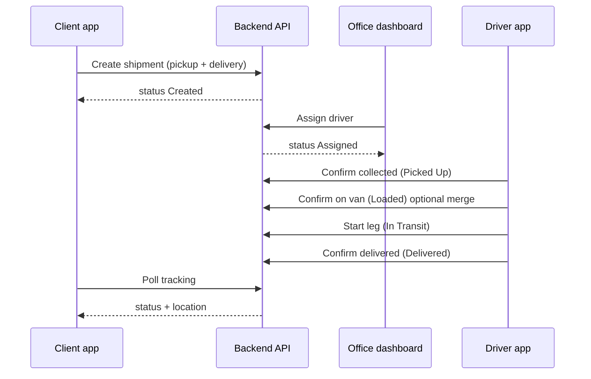

# Door-to-door parcel flow — dissertation narrative & implementation plan

**Purpose:** Align CMP600 with a **real courier process**: the client requests a parcel send; the office assigns a driver; the driver **collects from the sender**, **loads** the van, **drives**, and **delivers to the recipient** (address or hub). This document is for **Chapter 4/5** text and for **phased code work**.

**Historical gap (resolved in S4):** One address per shipment, single delivery stop in UI. **Pickup + delivery** and status `Picked Up` are now in the prototype.

**Open gap (routing — see `Door_to_Door_Routing_Strategy.md`):** **Optimise** still batches *active* legs (often all pickups at start of day) instead of a **depot → pickup → deliver → nearest next pickup** chain. Target policy, dissertation text, and implementation plan are in that document.

---

## 1. Business process (for dissertation)

### 1.1 Actors

| Actor | Role |
|--------|------|
| **Client (sender)** | Creates a shipment request: where to collect, where to deliver, service level, date. |
| **Office (dispatcher)** | Reviews requests, assigns a driver, handles exceptions (delayed, reassign). |
| **Driver** | Collects parcel from pickup, loads van, drives route, delivers to drop-off. |
| **Recipient** | Passive; may be named in notes; delivery is to `delivery_address`. |

### 1.2 Happy-path sequence



### 1.3 Status model (target)

| Status | Meaning | Who sets it |
|--------|---------|-------------|
| **Created** | Request received; no driver yet | Client order |
| **Assigned** | Driver allocated; not yet at pickup | Office assign |
| **Picked Up** | Driver collected parcel from sender | Driver |
| **Loaded** | Parcel on van (optional; can merge with Picked Up) | Driver |
| **In Transit** | Driving toward delivery address | Driver |
| **Delivered** | Handed to recipient / hub | Driver |
| **Delayed** | Exception (failed attempt, traffic, etc.) | Driver / office |

**Prototype simplification (recommended):** Use **five** backend statuses and map **Loaded** to driver-local “parcels on van” until Phase 2:

`Created → Assigned → Picked Up → In Transit → Delivered` (+ `Delayed`)

**Dissertation wording:** “Loaded” is modelled in the driver UI as parcel count on van; a full **Loaded** server status can be added if audit trail is required.

### 1.4 Mapping old buttons (driver — delivered correction)

| Old UI | Old backend | New meaning |
|--------|-------------|-------------|
| Mark active again | `Assigned` | Undo Delivered → back to **assigned**, pickup not done again |
| Resume in transit | `In Transit` | Undo Delivered → **en route to delivery** (skip pickup) |

After door-to-door flow exists, rename in UI:

- **Mark active again** → **Reopen job (at pickup)** → `Assigned`
- **Resume in transit** → **Reopen job (en route to delivery)** → `In Transit`

---

## 2. Data model changes (backend)

### 2.1 `shipments` table — new columns

| Column | Type | Description |
|--------|------|-------------|
| `pickup_address` | `String(256)` | Sender collection point (text) |
| `pickup_lat` | `Float` | Pickup coordinates |
| `pickup_lng` | `Float` | Pickup coordinates |
| `delivery_address` | `String(256)` | Rename concept from `destination` (keep column name `destination` in DB for migration ease **or** add alias in API) |
| `recipient_name` | `String(128)` optional | For dissertation realism |
| `parcel_count` | `Integer` default 1 | Replaces implicit “1 parcel” in load UI |

**Migration strategy (`sqlite_migrate.py`):**

1. Add nullable pickup columns.
2. Backfill: `pickup_address = 'CMP600 Hub'`, `pickup_lat/lng = HUB_LAT/LNG` for existing rows; `delivery_address` = existing `destination`.
3. New client orders: require pickup + delivery from form.

### 2.2 Route geometry

Today: `ROUTE_BY_SHIPMENT` is one polyline to `dest_*`.

**Target:** Two legs per shipment:

- Leg A: depot/current → **pickup** (when `Assigned`)
- Leg B: pickup → **delivery** (when `Picked Up` or `In Transit`)

`GET /shipments/{id}/route` returns coordinates based on `status`:

- `Assigned` → route to pickup
- `Picked Up` / `In Transit` → route to delivery
- `Delivered` → empty or last point only

### 2.3 Status pipeline (simulator)

Update `STATUS_PIPELINE` in `simulator.py`:

```python
STATUS_PIPELINE = ["Created", "Assigned", "Picked Up", "In Transit", "Delivered"]
```

GPS loop: while `Assigned`, animate toward pickup; after `Picked Up`, toward delivery.

### 2.4 API contract additions

| Endpoint | Change |
|----------|--------|
| `POST /clients/{id}/shipments` | Body: `pickup_address`, `pickup_lat`, `pickup_lng`, `destination` (delivery), `parcel_count`, existing fields |
| `GET /clients/{id}/orders` | Return pickup + delivery labels |
| `GET /drivers/{id}/delivery-queue` | Each item: `pickupAddress`, `deliveryAddress`, `phase` (`pickup` \| `delivery`) derived from status |
| `GET /drivers/{id}/shipments-map-context` | Two markers per open job optional: pickup pin + delivery pin |
| `POST /shipments/{id}/status` | Allow `Picked Up`; validate transitions (see §2.5) |
| `GET /shipments/{id}/tracking` | `phase`, `pickupLocation`, `deliveryLocation` |

**Allowed transitions (server-side validation):**

```
Created → Assigned (office only)
Assigned → Picked Up | Delayed
Picked Up → In Transit | Delayed
In Transit → Delivered | Delayed
Delayed → Assigned | Picked Up | In Transit (contextual)
Delivered → Assigned | In Transit (reopen only, driver edit)
```

### 2.5 Deprecate / keep

- Keep `destination` column as **delivery address** in API responses (`deliveryAddress` alias) to avoid breaking all clients at once.
- Office assign unchanged: `POST /dashboard/shipments/{id}/assign`.

---

## 3. Application changes by component

### Phase 1 — Backend + documentation (foundation)

**Effort:** ~1–2 days  

- [ ] Migration + model fields (§2.1)
- [ ] Client create + seed data with realistic pickup/delivery pairs
- [ ] Status `Picked Up` in `allowed_status` and transition validator
- [ ] Update `delivery-queue` and `shipments-map-context` payloads
- [ ] Route endpoint two-leg logic (minimal: straight line pickup→delivery)
- [ ] Update `Implementation_Notes_DEV.md` and API contract doc
- [ ] Smoke tests in `test_smoke.py` for new status

**Dissertation:** Paste §1 and §2 into **Chapter 4 (Design)** and **Chapter 5 (Implementation)**.

### Phase 2 — Client app (sender request)

**Effort:** ~0.5 day  

- [ ] Form: **Pickup address** (+ optional map/lat-lng), **Delivery address**, parcel count
- [ ] Copy: “Driver will collect from pickup and deliver to delivery address”
- [ ] Orders table columns: Pickup → Delivery, status
- [ ] Tracking map: show target = pickup until `Picked Up`, then delivery

### Phase 3 — Office dashboard

**Effort:** ~0.5 day  

- [ ] Shipments table: Pickup | Delivery | Status
- [ ] Map: pickup (e.g. orange) vs delivery (e.g. blue) markers
- [ ] Filter status includes `Picked Up`
- [ ] Assign flow unchanged; tooltip explains door-to-door job

### Phase 4 — Driver app (core UX)

**Effort:** ~2–3 days  

#### 4.1 Job model in UI

Each **shipment** = **two stops** in the run list (or one card with two phases):

| Stop type | When active | Map pin | Primary action |
|-----------|-------------|---------|----------------|
| **Collect** | `Assigned` | Pickup | **Navigate** → **Collected** (`Picked Up`) |
| **Deliver** | `Picked Up` / `In Transit` | Delivery | **Navigate** → **Done** (`Delivered`) |

**Optimise route:** Order stops as: depot → pickup₁ → delivery₁ → pickup₂ → delivery₂ … (only include delivery stops whose pickup is `Picked Up` or same shipment already collected).

#### 4.2 Replace confusing reactivate labels

In **Edit stop** when `Delivered`:

- **Reopen at pickup** (`Assigned`) — full redo from collection
- **Reopen en route to delivery** (`In Transit`) — mistake after collection

Remove generic “Mark active again” / “Resume in transit” wording.

#### 4.3 Parcels on van

- Sync `parcel_count` from API; load buttons update local state until **Collected**, then POST `Picked Up` when all parcels confirmed.
- Hide “Load all” after `Picked Up`; show “Start delivery” → `In Transit`.

#### 4.4 Float card / list

- Show **phase badge**: COLLECT vs DELIVER
- Address line shows pickup or delivery depending on phase
- Remove duplicate note editor (done) — notes only in Edit stop

#### 4.5 Map

- Active stop centres on current phase coordinates
- Full-width footer buttons (done) — keep covering attribution

### Phase 5 — Polish & evaluation

**Effort:** ~1 day  

- [ ] Update `GAP_Checklist_Tracking.md` and Delm8 comparison
- [ ] Seed scenarios for usability test (3 statuses visible to client)
- [ ] `latency_check.py` unchanged; document new endpoints in ethics/heuristics if needed

---

## 4. Dissertation chapter mapping

### Chapter 4 — Design

1. **Problem domain:** B2C door-to-door courier (not depot-only last mile).
2. **Use case diagram:** Client, Office, Driver; include `CreateShipment`, `AssignDriver`, `CollectParcel`, `DeliverParcel`.
3. **Status machine diagram:** §1.3 table + transition rules §2.5.
4. **Data model:** ER snippet with pickup + delivery on `Shipment`.
5. **Prototype scope:** Simulated GPS, no payment, single hub fallback for legacy seed.

### Chapter 5 — Implementation

1. **Stack** (unchanged from `Implementation_Notes_DEV.md`).
2. **API evolution:** before/after JSON example for create shipment.
3. **Driver UI:** screenshot callouts — Collect stop vs Deliver stop.
4. **Limitations:** Loaded on device; no proof-of-delivery signature; prototype auth.

### Chapter 6 — Evaluation

- Task scenario: “Client books pickup Canary Wharf → delivery Isle of Dogs; office assigns D101; driver collects then delivers.”
- Success: client sees status progression including **Picked Up**.

---

## 5. Implementation order (recommended sprint)

| Sprint | Deliverable | Apps touched |
|--------|-------------|--------------|
| **S1** | DB migration + `Picked Up` + API payloads | backend |
| **S2** | Client pickup/delivery form + tracking phase | client |
| **S3** | Dashboard columns + map pins | dashboard |
| **S4** | Driver two-phase stops + status buttons | driver |
| **S5** | Route legs + optimiser + simulator | backend, driver |
| **S6** | Docs + GAP checklist + dissertation paste | Documentation |

---

## 6. Risk & scope control

| Risk | Mitigation |
|------|------------|
| Breaking API contract doc | Version `API_Contract_v1.1` addendum; keep `destination` alias |
| Route optimiser complexity | Phase 4: fixed order per shipment (pickup before delivery); optimiser only reorders shipments |
| Dissertation time | Ship S1–S4 minimum; S5 simulator polish optional |
| Legal attribution on map | Keep UI over attribution (current behaviour) |

---

## 7. Acceptance criteria (definition of done)

1. Client can create a shipment with **distinct pickup and delivery addresses**.
2. Office can assign driver; status **Assigned**.
3. Driver sees **Collect** job first; action sets **Picked Up**.
4. Driver then sees **Deliver** job; **Done** sets **Delivered**.
5. Client tracking shows status including **Picked Up**.
6. Documentation (`Implementation_Notes_DEV.md` + this plan) matches deployed behaviour.
7. `npm run build` / backend smoke tests pass.

---

## 8. Files to touch (checklist)

### Backend

- `app/models.py`, `app/sqlite_migrate.py`, `app/main.py`, `app/seed.py`
- `app/simulator.py`, `app/route_geometry.py`
- `tests/test_smoke.py`

### Client

- `client_app/src/App.tsx`, `client_app/src/api.ts`

### Dashboard

- `dashboard/src/App.tsx`

### Driver

- `driver_app/src/App.tsx`, `StopFloatCard.tsx`, `StopListRow.tsx`, `EditRouteScreen.tsx` (if stops split)
- `routeMetrics.ts`, `driverSimulation.ts`
- `courier-styles.css`, `swipe-stop.css`

### Documentation

- `Implementation_Notes_DEV.md`
- `Door_to_Door_Routing_Strategy.md` ← **routing policy & Sprint R1–R3**
- `GAP_Checklist_Tracking.md`
- `API_Contract_v1.docx` (manual update)
- Dissertation Ch.4/5 (paste from §4 and routing doc §8)

### Driver (routing sprint — planned)

- `doorToDoorRoute.ts` (or `runStops.ts`) — `buildDoorToDoorPlan`
- `routeMetrics.ts` — keep haversine; optional compare helper
- `App.tsx` — Optimise + polyline + next stop
- `StopListRow.tsx` — dual address display

---

*Last updated: S1–S5 + Sprint R1–R3 implemented (May 2026); Sprint R4 (PD-VRP, OSRM) deferred.*
